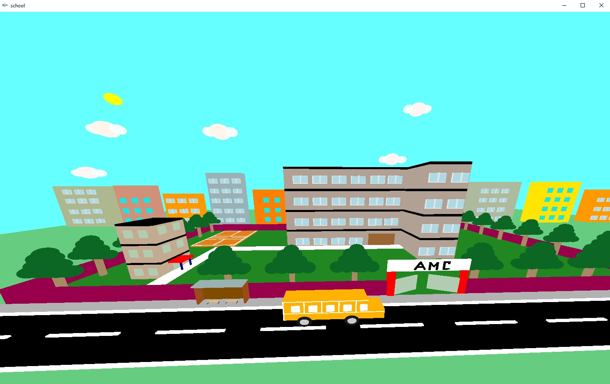

# School Campus Simulation using GLUT and OpenGL

This project simulates a school campus using 2D and 3D graphics with the help of the GLUT and OpenGL libraries. The simulation includes various visual elements and interactive features, providing a basic introduction to graphics programming.

---

## Features

- 3D representation of campus structures.
- Interactive camera movement and keyboard controls.
- Modular codebase with reusable components.
- Built using OpenGL and GLUT for real-time rendering.

---

## Technologies Used

- **Programming Language:** C++
- **Graphics Libraries:** OpenGL, GLUT
- **Development Environment:** Code::Blocks

---

## Output



---

## Installation

### Prerequisites To run this project.

### Step 1: GLUT Setup

1. Download `glut-3.7.6-bin` from Google.
2. Unzip the file. There will be at least three files: `glut.h`, `glut32.dll`, and `glut32.lib`.
3. Navigate to `C:\Program Files (x86)\CodeBlocks\MinGW\include`.
   - Paste `glut.h` into the `GL` folder.
4. Navigate to `C:\Program Files (x86)\CodeBlocks\MinGW\lib`.
   - Paste `glut32.lib`.
5. Navigate to `C:\Windows\SysWOW64`.
   - Paste `glut32.dll`.
   - **Note:** If your Operating System is 32-bit, the folder might be `C:\Windows\System32`.

### Step 2: Linker Settings for Code::Blocks

1. Go to `Settings` > `Compiler` > `Linker Settings` and press `Clear`.
2. Press `Add`, then navigate to `C:\Program Files (x86)\CodeBlocks\MinGW\lib`.
3. Add the following files:
   - `glut32.lib`
   - `libglu32.a`
   - `libopengl32.a`
4. Press `OK`.

### Step 3:
Open the code block later, open the project, and run the .cbp file.

---

## Usage

- **Camera Movement:**
  - Arrow keys to navigate the camera view.
- **Interactive Elements:**
  - Specific keys to trigger actions (e.g., lighting effects or object animations).
- **Display Settings:**
  - Adjust display settings through `Display.cpp` for custom rendering.

---

## File Structure

```
.
├── main.cpp                 # Entry point for the application
├── Display.cpp/.h           # Handles display and rendering logic
├── Elements.cpp/.h          # Manages different campus components
├── cube.cpp/.h              # Implements 3D cube elements
├── handleKeyboard.cpp/.h    # Keyboard input handling
├── 2_D_basic.cbp            # Code::Blocks project file
├── .gitignore               # Git ignore settings
└── README.md                # Project documentation
```

---

## Contributing

Contributions are welcome! You can fix this repository and submit a pull request with enhancements or bug fixes.

---


## Acknowledgments

- Inspired by OpenGL's capabilities in rendering interactive graphics.

---

## Contact

For questions or feedback, feel free to reach out via email

